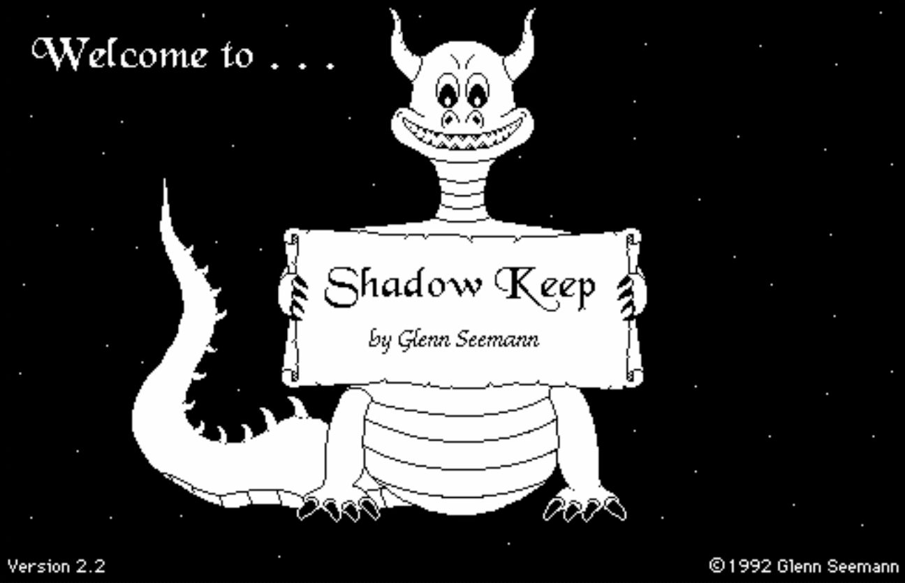
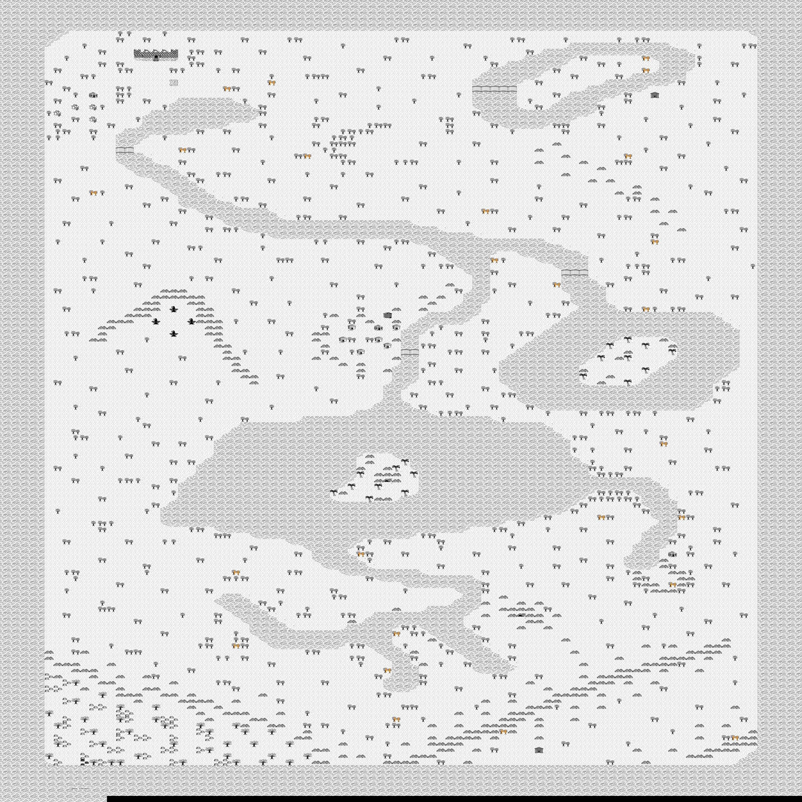
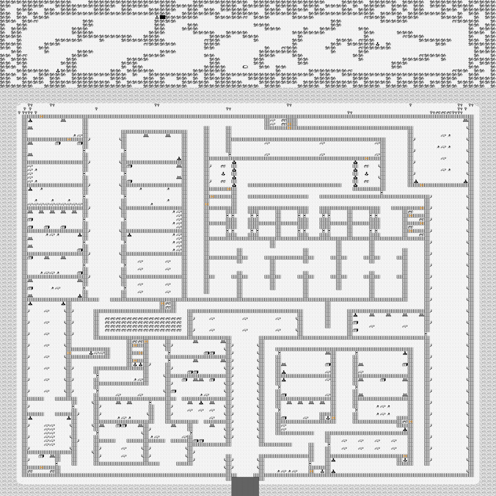
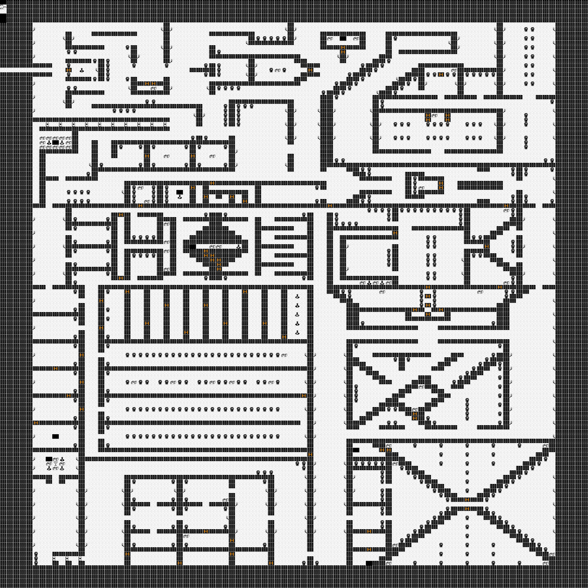
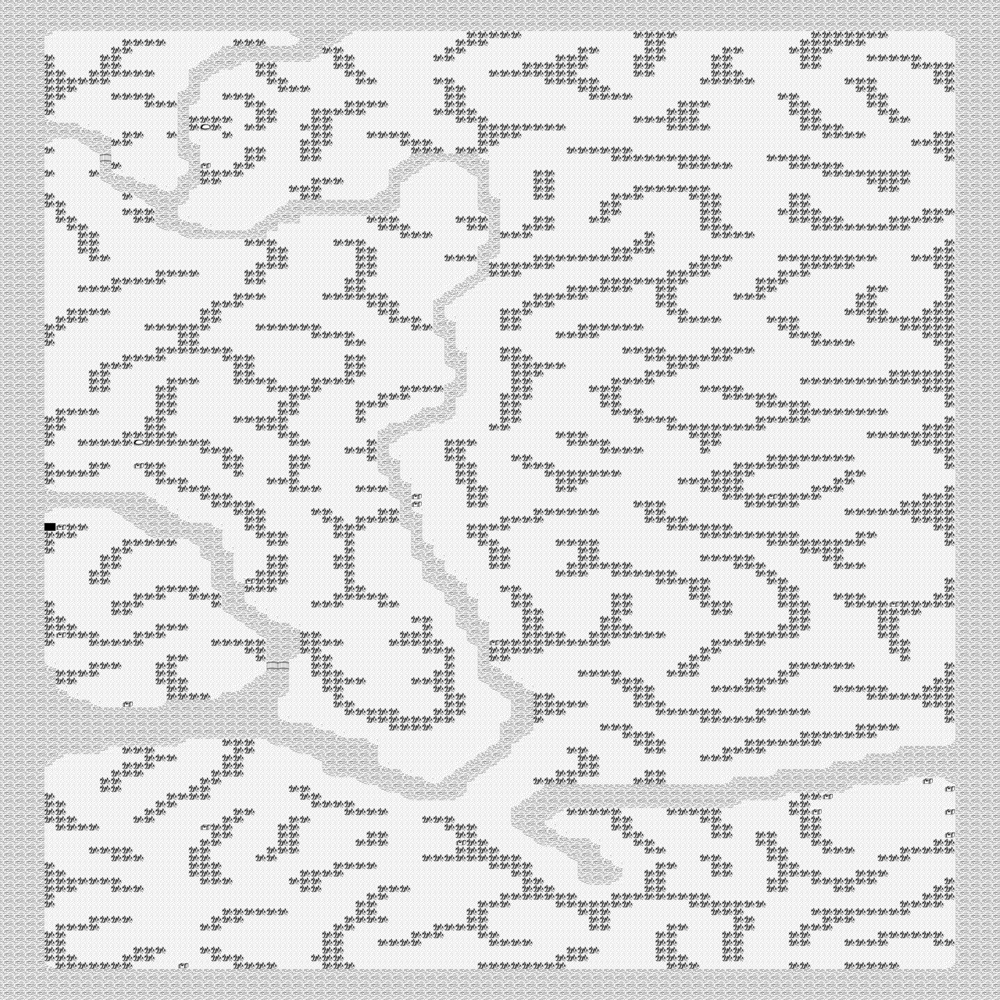
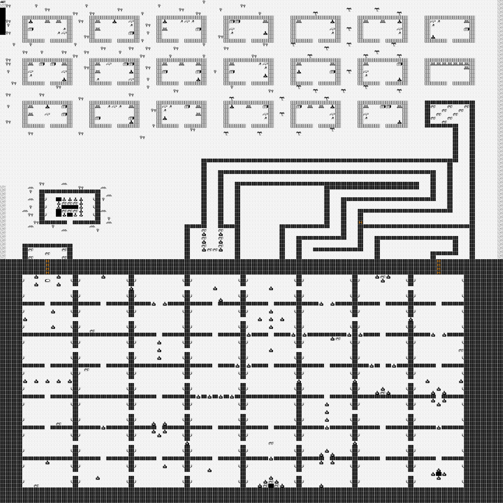
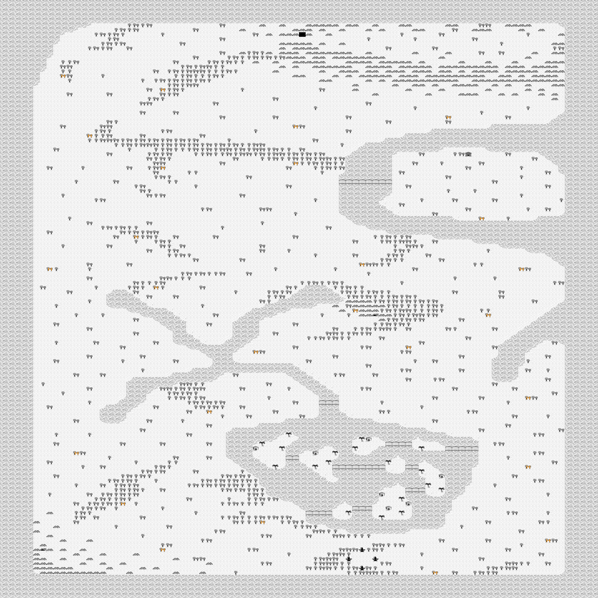
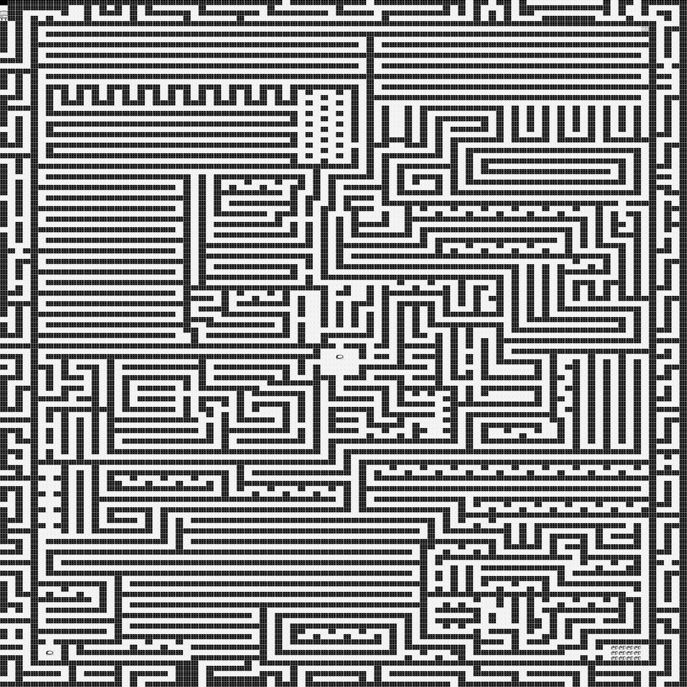

# Shadow Keep Game Maps

Shadow Keep is a 1992 Game by Glenn Seemann for the Macintosh.

This repo has the code I created to recreate the original maps from the Game and of course the maps.  I made a [youtube walkthrough](https://youtu.be/kR4bPufW1vw) of this game on a day off in  2024.

## Shadow Keep Game Background from archive.org

- Shadow Keep by Glenn Seeman
- Publication date 1991
- Topics Shadow Keep, Mac, Macintosh, Apple Mac

Excerpt from "A Short Guide To Shadow Keep v1.1" by Bob Nordling: [Source](https://archive.org/details/ShadowKeepMacintosh)

    "Only the elder knights of Shadow Keep remember the Great Battle with the Evil Overlord, a battle in which The Black Sword, his powerful magical weapon, was lost by him in the heat of battle and his forces routed. Not Even in the dark corners of taverns do they whisper his name, especially not in the darkness... But through childhood tales, all in the kingdom have heard of that evil knight/magician, and his uncanny ability to heal himself even in the midst of battle... and the tales recount that it was not until The Black Sword was lost to him did his hideous grin turn into a scornful grimace. For in the final hours of The Great Battle, The Black Sword was turned against him, and as many slain and maimed knights had already learned, the blows by that vile weapon did not heal, neither by nature nor by magic."

    
## Code background

1. Got the hex data from the macintosh binary
2. Worked out the dimensions of the map
3. Identified what sprite each Hex code represents
4. Recreated each map as a PNG file based on sprites which I Screenshotted from the game.

Its not polished code, its just my quick work through of it using a Python Notebook. It was done in a single sitting.

Sorry I resource-hacked your game Glenn. (I'm sure you don't mind :)

## My Story of the Game

I enjoyed this game when I was young and its just always stuck in my memory. I revisited it again in 2023-2024 for a more in depth exploration (and to finally finish it). I put together [this video of my final run through](https://youtu.be/kR4bPufW1vw), demonstrating most of the elements of the game.
Thank you to Glenn Seemann (developer), my dad for exposing me to this  (when I was around 7 or 8) and everyone in the Retro Mac community keeping old gems like this alive.

## Maps
Here are the rendered maps. They all used the same size of 90x130.

### Kingdom

### Castle 
Interestingly has the Spider Cave above the Castle.

### Catacombs

### Cave

### Dwelling
Has the Dungeon under the castle, the dwellings and the Hidden Passage to John

### The Far Land "Kingdom2"

### Labyrinth

There are 2 interesting features. In the bottom left there is lots of treasure. In the Top there is a long pathway to a scroll that says "This is the wrong way".

